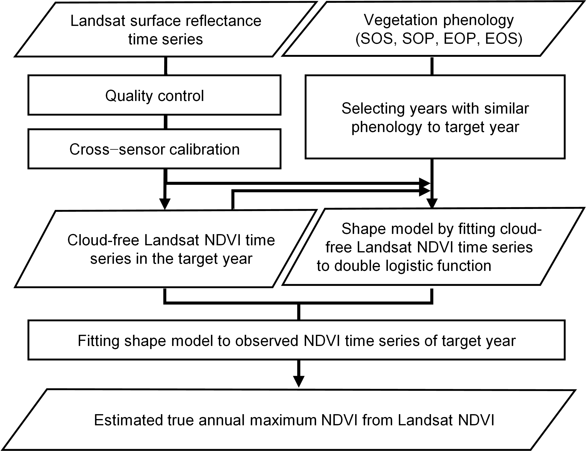

# Similar-Pheno-SMF
Similar–Pheno SMF uses a long-term Landsat NDVI time series to estimate the true annual NDVImax, following the steps in Figure 1. In this approach, “shape model” refers to the shape of the annual NDVI curve (i.e., the progress of NDVI values as a function of the day of year). 

Figure 1. Overview of the method for estimating true annual maximum normalized-difference vegetation index (NDVImax) from the Landsat NDVI time series by the similar phenology shape-model fitting (Similar–Pheno SMF) methods. Abbreviations: EOP, end of peak growth; EOS, end of the growing season; SOP, start of peak growth; SOS, start of the growing season.

First, quality control is performed on the surface reflectance data from Landsat 5, 7, and 8 to obtain a high-quality, cloud-free Landsat NDVI time series. 
Please refer to the 'Download_CrossCalibration_L578_NDVI.py' for details.

Second, NDVI values are calibrated across the Landsat 5, 7, and 8 sensors. 
Please refer to the 'Download_CrossCalibration_L578_NDVI.py' for details.

Third, for the target year of a given pixel, the reference annual NDVI time series is synthesized from the high-quality, cloud-free NDVI data of the target year combined with data from other years with phenology similar to that of the target year. This reference annual NDVI time series is then used to construct a shape model for the target year. 
Please refer to the 'JN_GIMMS_NDVI_Phenology','Get_Similar_Phenology_Years', and 'Calculate_Max_NDVI.py' for details.

Fourth, the shape model is used to fit the cloud-free NDVI time series of the target year, thereby estimating the true annual NDVImax.
Please refer to the 'Calculate_Max_NDVI.py' for details.
